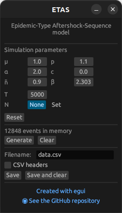

# ETAS

A Rust implementation of the Epidemic-Type Aftershock Sequence
stochastic model.

## Usage

```shell
$ etas --help
A simple Epidemic-Type Aftershock-Sequence model implementation

Usage: etas [OPTIONS]

Options:
      --mu <MU>              [default: 1]
      --alpha <ALPHA>        [default: 2]
      --bar-n <BAR_N>        [default: 0.9]
      --p <P>                [default: 1.1]
      --c <C>                [default: 0.000000001]
      --beta <BETA>          [default: 2.3025851]
      --t-end <T_END>        [default: 1000]
      --max-len <MAX_LEN>    
      --filename <FILENAME>  [default: data.csv]
      --verbose              
      --headers              
      --no-gui               
      --seed <SEED>          
  -h, --help                 Print help
  -V, --version              Print version
```

## Installation

```shell
git clone https://github.com/alphonsepaix/etas.git
cd etas
cargo build --release
```

## GUI
A graphical user interface is available.



You can utilize the command-line interface by including the `--no-gui`
flag when invoking the program.
